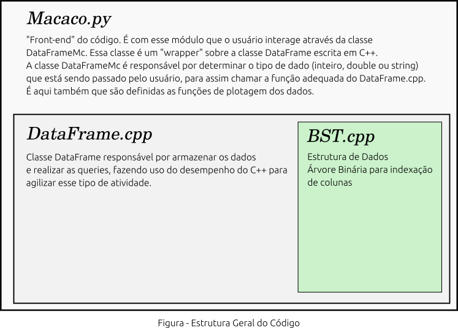

# Macaco - DataFrame C++/Python 
## Projeto Final do curso de Algoritmos e Estrutura de Dados
Autores: Davi Barreira, Flavio Fontanella
   

## Descrição
Este trabalho consistiu na criação de uma biblioteca entitulada **Macaco**
com funcionalidades parecidas com a famosa biblioteca Pandas do Python,
porém, nossa biblioteca utiliza [Python Boost](https://www.boost.org/doc/libs/1_70_0/libs/python/doc/html/index.html)
para realizar a integração do código de C++ com Python, utilizando o Python como interface
com o usuário.

## Instalação e Uso

Para se instalar o pacote basta clonar o repositório, entrar na sua pasta e executar:
```sh
pip install -e .
```
Recomenda-se utilizar um ambiente virtual para não instalar o pacote no seu Python nativo.

Uma vez instalado o pacote, basta fazer:
```sh
import Macaco as mc
df = mc.DataFrameMc()
```
Para entender melhor como utilizar, dê uma olhada no Macaco_Notebook_Showcase.ipynb

## Estrutura da Repositório
Uma breve explicação sobre os arquivos deste repositório:
* Macaco.py     - Modulo de Python contendo a biblioteca Macaco;
* DataFrame.cpp - DataFrame implementado em C++ utilizado pelo modulo Macaco;
* DataFrame.o , DataFrame.so - Arquivos binários utulizados pelo
Python Boost para importação dos arquivo em C++;
* BST.cpp - Estrutura de árvore binária utilizada pelo DataFrame.cpp;
* compile_pyboost.sh - Script para compilar o código de C++;
* setup.py - Arquivo com informações sobre a instalação do pacote Macaco;
* Macaco_Notebook_Showcase.ipynb - Notebook com showcase da biblioteca.
Dê uma olhada para ver um exemplo prático de como utilizá-la;
* Imagem/  - Pasta com imagens utilizadas no README.md;
* Testes/  - Pasta com dois scripts de Python utilizados para testar a bibliotca. Script TestingMacaco_Iris.py compara os resultados do Macaco com
a biblioteca Pandas. Script TestingMacaco.py roda funções padrão do 
dataframe, garantindo assim a execução sem erros.
* Vagrantfile - Arquivo de configuração de máquina virtual Vagrant.

## Requerimentos
Essa biblioteca utiliza `C++17` e `Python 3.6`. Durante a instalação do 
pacote Macaco, são instaladas também a biblioteca Matplotlib e Tabulate.
Para rodar o TestingMacaco_Iris.py é necessário ter também instalada a 
biblioteca Pandas, Numpy e Seaborn do Python.

Note que os binários do C++ já vem junto com o repositório. Eles foram
compilados em Linux, portanto, é possível que não funcione diretamente
em outros sistema Operacionais, sendo assim necessário que o usuário
compile novamente os arquivos. Caso seja o caso, o usuário precisará
instalar a biblioteca Boost com Python Boost em seu computador, junto
com um compilador para C++17.

Para que o Python funcione com o Python Boost, no Linux é necessário
instalar a biblioteca `libboost-python-dev`.

## Utilizando com Vagrant
Junto com o código estamos também colocando o arquivo de configuração para
a criação de uma máquina virtual Ubuntu utilizando
[Vagrant](https://www.vagrantup.com/intro/getting-started/). Nesse arquivo estão
os comando necessários para gerar a máquina virtual pronta para rodar a biblioteca.
Estamos fazendo isso para evitar problemas de o código não rodar devido alguma
particularidade do sistema operacional do usuário. Explicar como utilizar o Vagrant
está fora do escopo desse projeto.

Uma vez que o usuário já tenha o vagrant instalado, basta executar de dentro do repositório:

```sh
vagrant up
```
Esse comando irá subir a máquina com as configurações no Vagranfile. E em seguida,
para acessar a máquina virtual:
```sh
vagrant ssh
```


## Documentação do Código
Abaixo mostramos a estrutura geral do código. Ele é composto por três
arquivos principais que já falamos na sessão de "Estrutura do Repositório".



### BST.cpp
Arquivo contém a estrutura de dados da árvore binária com algumas
modificações. Primeiro, nos nodes da árvore, além do valor do node em si,
um novo atributo `rows` foi adicionado, que armazena as linhas do dataframe
que contém aquele node. Além disso foram implementadas funções auxiliares para
realizar queries, inserir e remover os rows de cada node. O código dessas funções
é relativamente simples, assim recomendamos que o usuário interessado dê uma lida no
código em si.

A clase BST é importada dentro do arquivo DataFrame.cpp, onde é utilizada para a indexação.

### DataFrame.cpp
Contém a classe DataFrame que é importada pelo módulo Macaco. Além de uma série de funções implementadas,
a classe DataFrame contém 3 *maps* de string para vetores, e 3 *maps* de string para BST's. São os *maps*
de vetores que armazenam os vetores com os dados do dataframe. O motivo de serem três diferentes é que 
cada um é utilizado para um tipo de dados. Aqui vale ressaltar, a biblioteca só permite trabalhar com dados dos tipos
"int", "double" e "string". Os três *maps* para as árvores binárias também consistem em um para cada tipo de árvore.
Quem faz o gereneciamente de quando chamar qual função é o código em Python do arquivo Macaco.py.

Perceba que devido ao fato de termos que lidar com 3 tipos de dados, basicamente todas as funções da classe
DataFrame são triplicadas, pois temos uma versão para cada tipo de dado.

Ao final do arquivo DataFrame.cpp temos o código do Python Boost para permitir realizar a comunicação com o código
em Python. Novamente, o código aqui é relativamente extenso devido à triplicação de cada função, porém, cada
função é relativamente simples de se entender. O propósito de cada função está em comentário no próprio código.

### Macaco.py
Esse é o arquivo que faz a interface com o usuário. Ele funciona como um *wrapper* para a classe DataFrame implementada
em C++. A classe contida nesse arquivo é chamada de `DataFrameMc`. Ela é responsável por fazer um tipo de curadoria dos dados
fornecidos pelo usuário, garantindo que tem o formato correto e tipo correto antes de chamar a função em C++. Essa classe
contém os seguintes atributos:

-    `self.df`      : Esse atributo contém o DataFrame implementado em C++ e é usado para chamar as funções implementadas no DataFrame.cpp;
-    `self.colunas` : É um dicionário de colunas com seus respectivos tipos (ex: {'coluna':'double','coluna2':'int'})
-    `self.shape`   : Contém a quantidade de linhas x colunas
-    `self.indices` : Lista de colunas que estão indexadas, ou seja, que foi criada uma ávore binária para elas.


Abaixo uma breve descrição das funções. Para melhor entender como utilizá-las, recomendamos olhar o arquivo Macaco_Notebook_Showcase.ipynb:


```py
    def InserirColuna(self,valores,nome_coluna):
    """ 
    Infere o tipo do dado. Caso encontre multiplos,
    transforma em string. Valores devem ser passados dentro de uma lista.
    """

    def GetColuna(self,nome_coluna):
    """ 
    Recebe uma coluna e retorna uma lista contendo os valores daquela coluna.
    """

    def RemoverColuna(self,nome_coluna):
    """ 
    Remove coluna do DataFrame.
    """


    def RemoverLinha(self, linhas):
    """
    Recebe uma lista de linhas e às remove do dataframe.
    """

    def GetLoc(self,linha, nome_coluna):
    """
    Recebe lista de linhas e UMA coluna e retorna os respectivos dados.
    """

    def GetLinha(self, linha):
    """
    Recebe lista de linhas e retorna dados.
    """

    def GetDados(self):
    """
    Retorna todo os dataframe em formato de dicionario.
    """

    def Slice(self, linhas,nome_colunas):
    """
    Recebe lista de linhas e lista de colunas e retorna os dados respectivos
    em formato de dicionario.
    """

    def Show(self, dados):
	"""
    Recebe dicionario e printa em formato tabular
	"""

    def InserirLinha(self,valores):
    """
    Insere linha no final do dataframe. Note que *valores* deve ter a forma de um
    dicionário do tipo {'coluna1': [valor], 'coluna2':[valor]}
    """

    def IndexarColuna(self, nome_coluna):
    """
    Recebe nome de coluna e indexa, criando uma estrutura de árvore binária atrelada.
    """

    def RemoverIndice(self, nome_coluna):
    """
    Remove indexação da coluna. O código em C++ remove a árvore atrelada àquela coluna.
    """

    def Query_Tree(self, nome_coluna, operador,valor):
    """
    Usuario deve usar funcao Query. Essa eh um funcao auxiliar
    para fazer query na arvore binaria.
    """

    def Query_Simples(self, nome_coluna, operador, valor):
    """
    Usuario deve usar funcao Query. Essa eh um funcao auxiliar
    para fazer query sem arvore.
    """

    def Query(self, nome_coluna, operador, valor):
    """
    Funcao para fazer query no dataframe. Operadores sao '==','<','<=','>','>='.
    Ela retorna as linhas contendo aqule informação, assim deve ser chamada em conjunto com
    a função self.GetLinhas() para retornar os valres.
    """

    def QueryRect(self, queryrect, nome_coordenada1, nome_coordenada2):
    """
    Exige que colunas de coordenadas sejam de double.
    queryrect = [xmin,ymin,xman,yman]
    """

    def Plot(self,nome_coluna1,nome_coluna2, *args,**kwargs):
    """
    Realiza plotagens do tipo scatter e line, dependendo dos argumentos
    fornecidos pelo usuário.
    """

    def Hist(self,nome_coluna1, *args,**kwargs):
    """
    Cria histograma com dados da coluna escolhida.
    """

    def Hist2D(self,nome_coluna1, nome_coluna2,*args,**kwargs):
    """
    Cria histograma 2D com colunas escolhidas.
    """

    def BarPlot(self, coluna_altura, coluna_posicao, tipo='soma',*args, **kwargs):
    """
    Faz uma plotagem de gráficos de barra. O usuário pode escolher três tipos, sendo eles:
    'soma', 'contador' e 'media'. Assim, a altura das barras será ou a soma, ou media ou quantidade
    de vezes que o valor da posicao apaerceu.
    """
```
